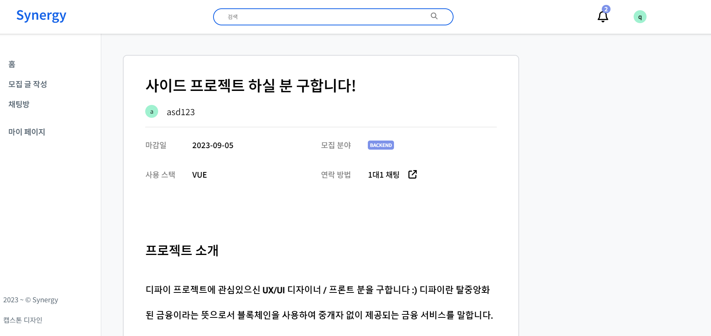

# Synergy(개발자들을 위한 프로젝트 매칭 사이트)

## 🔍 Info

- ###### 3인 개발
- ###### Frontend(1인) 및 디자인 담당
- ###### 프로젝트 이름: Synergy
- ###### 개발 기간: 2023.05 ~ 2023.11

## 💾 Background

부경대학교 재학 중 캡스톤디자인 과목에서 팀으로 진행한 프로젝트입니다. 기존 프로젝트 매칭 사이트에서의 소통 방법 등의 아쉬운 점을 보완하여 만들었습니다. 강의로만 듣던 React를 프로젝트에서 실사용한 게 처음이었고 또한 Redux의 사용도 처음이었기에 후에 진행한 프로젝트에서 Recoil을 사용할 때 Redux와 비교하며 장단점을 파악할 수 있었습니다. 모르는 부분이 많은 채로 시작한 프로젝트였기에 이 프로젝트를 진행하면서 공식문서가 정말 중요하다는 것을 깨닫게 되었습니다.

처음 시작할 때는 CORS 문제부터 난관이었지만 하나하나 해결해나감으로써 팀원과의 소통, 백엔드로의 여러 요청 방법 등 많은 것을 배울 수 있었던 프로젝트였습니다. 팀 단위로 웹사이트를 제작하는 경험이 처음이라 api 요청 하나에도 작은 어려움들이 있었습니다. 요청 데이터를 body 데이터로 전달해야하는지, query params로 전달해야하는지 등 그간 백엔드와 소통을 한 경험이 없어 진행하는 속도가 좀 느렸던 것 같습니다.

##### **주요 기능**

- 모집하는 포지션, 기술스택, 기간 등을 설정하여 모집글을 작성
- 여러 모집글 중 참여하고 싶은 모집 글을 쓴 유저와 댓글 혹은 실시간 채팅으로 소통

<div style="display: flex; justify-content: center;">
  <figure style="display: flex; flex-direction: column; align-items:center; width: 50%;">
    <figcaption>홈화면</figcaption>
    
  </figure>
  <figure style="display: flex; flex-direction: column; align-items:center; width: 50%;">
    <figcaption>프로젝트 상세화면</figcaption>
    
  </figure>
    <figure style="display: flex; flex-direction: column; align-items:center; width: 50%;">
    <figcaption>채팅 화면</figcaption>
    
  </figure>
</div>

## 🛠 Technology Stacks

- Frontend: React.js, redux, styled-component, axios
- Deployment: Netlify

## 💡 Getting Started

```bash
#Install Package & Run the development server
$cd client
$npm install
$npm start
```
